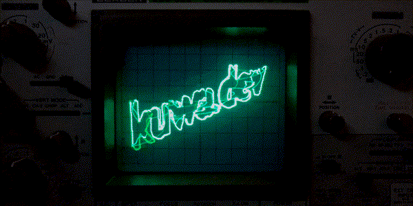

<p align="center">
  
</p>

### Hi there 👋

プログラミング、サーバー、電子工作、色々やってます

一番よく使う好きな言語はTSです！

contributionsが緑のときはコーディング、黒は大体インフラいじってます

## 🔗 SNS・プロジェクトリンク集

<p>
  
  <strong>kuwa-network:</strong> <a href="https://kuwa.app" >kuwa.app</a>
</p>

<p>
  
  <strong>Home:</strong> <a href="https://kuwa.dev" >kuwa.dev</a>
</p>

<p>
  
  <strong>Discord:</strong> <a href="https://kuwa.dev/discord/">kuwa.dev/discord</a>
</p>

<p>
  
  <strong>DiscordBot:</strong> <a href="https://kuwa.app/discord/">kuwa.app/discord/</a>
</p>

<p>
  
  <strong>DiscordSupport:</strong> <a href="https://kuwa.app/discord/support" >kuwa.app/discord/support</a>
</p>

<p>
  
  <strong>Twitter:</strong> <a href="https://kuwa.dev/tw">kuwa.dev/tw</span></a>
</p>

<p>
  
  <strong>GitHub:</strong> <a href="https://kuwa.dev/github">kuwa.dev/github</a>
</p>

以下宣伝
```
330円からレンタルサーバー販売してます！
BOT作成等プログラミング3000円から承ります 
```

## 📊 ステータス

<div>
  <a href="https://github.com/anuraghazra/github-readme-stats">
    
  </a>
</div>

<div>
  <a href="https://wakatime.com/@kuwa">
    
  </a>
  <a href="https://github.com/anuraghazra/github-readme-stats">
    
  </a>
</div>

---

📝 **WakaTimeを追加しました！** (2023/08/19)
