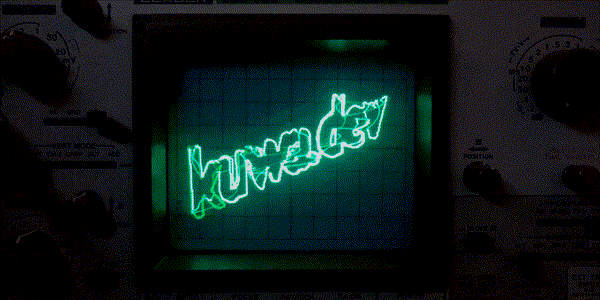

  

<h1 align="center">Hi there, I'm くわ 👋</h1>

  プログラミング・インフラ・電子工作・写真・映像・CG... 好きなこと何でもやる人 
  フルスタック

<table>
  <tr>
    <td align="center">
      <a href="https://kuwa.app">
        
        <strong>kuwa-network</strong>
      </a>
    </td>
    <td align="center">
      <a href="https://kuwa.dev">
        
        <strong>Portfolio</strong>
      </a>
    </td>
    <td align="center">
      <a href="https://kuwa.dev/tw">
        
        <strong>Twitter</strong>
      </a>
    </td>
    <td align="center">
      <a href="https://kuwa.dev/github">
        
        <strong>GitHub</strong>
      </a>
    </td>
  </tr>
  <tr>
    <td align="center">
      <a href="https://kuwa.dev/discord/">
        
        <strong>Discord</strong>
      </a>
    </td>
    <td align="center">
      <a href="https://kuwa.app/discord/">
        
        <strong>Discord Bot</strong>
      </a>
    </td>
    <td align="center" colspan="2">
      <a href="https://kuwa.app/discord/support">
        
        <strong>Discord Support</strong>
      </a>
    </td>
  </tr>
</table>

---

## 🙋 About Me

- 💻 よく使う言語は **TypeScript**
- 🟩 contributions が **緑** のとき → コーディング中
- ⬛ contributions が **黒** のとき → インフラいじり中
- 🔧 プログラミング / インフラ / 電子工作 が得意領域
- 大体何でもやります

---

## 🌟 My Favorite Weapons

**Languages**

**Frontend / Backend**

**Infra / Virtualization**

**Container / Orchestration**

**Network / SDN**

**Monitoring / Ops**

**CI/CD**

**Storage**

**AI / LLM**

**Hardware**

**Favorite Infra Vendors**

---

## 📊 Stats

  

  
  &nbsp;
  

  📝 <strong>Add 2026-04-06!!</strong> &nbsp;
  

---

## 💼 Services

> 🖥️ **レンタルサーバー** — 330円〜
> **Bot・アプリ・WEB作成・その他プログラミング依頼・サーバー運用・その他インフラ構築**〜
>
> **お気軽に Email, Discord または Twitter(X) からご連絡ください！**
